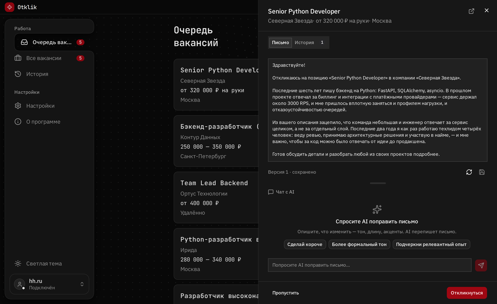

# Otklik

[liubimba.github.io/otklik](https://liubimba.github.io/otklik/) ·
[Релизы](https://github.com/liubimba/otklik/releases) ·
[In English](./README.md)

Десктоп-приложение для откликов на вакансии hh.ru: парсит вакансию, генерирует
сопроводительное письмо с помощью LLM на основе описания вакансии, вашего резюме
и пожеланий, даёт чат по каждому письму и, опционально, откликается за вас.

Всё работает локально, на вашем устройстве. Сервера у проекта нет: ни аккаунтов,
ни телеметрии, ни облака. За токены LLM платите только вы, напрямую своему
провайдеру по своему ключу.



> **Версия ранняя (0.2.x).** Прежде чем устанавливать, прочитайте раздел
> [«Риски»](#риски). Это не формальность.

## Риски

**Правила hh.ru формально запрещают автоматизацию откликов.** Использование
приложения может привести к временной или постоянной блокировке аккаунта.
Используйте его **на свой риск** и **не запускайте на основном рабочем аккаунте
hh.ru**. Гарантий не даёт никто.

Приложение работает под вашей собственной сессией hh.ru (вход вы выполняете
руками один раз в обычном окне браузера) и не использует официальный API hh.
Автоматический отклик по умолчанию **выключен**, включается осознанно.

Что приложение делает, чтобы снизить риск:

- **Консервативные лимиты по умолчанию.** Не больше 30 откликов в день и 5 в час,
  с задержкой 800 мс ± 400 мс между действиями. Значения настраиваются, но чем
  агрессивнее, тем выше риск.
- **Обычный браузер, обычный профиль.** Chromium с постоянным профилем: один
  ручной вход, без флагов «новое устройство» при каждом запуске.
- **Капча к вам, а не в обход.** Увидев капчу, приложение останавливается и
  зовёт вас. Никаких 2captcha и anti-captcha: активный обход резко повышает шанс
  перманентного бана.

При первом запуске приложение показывает это предупреждение и требует явного
согласия, прежде чем продолжить.

## Приватность

- **Нет сервера, аккаунтов и телеметрии.** Данные не покидают ваше устройство.
- **Локальное хранилище.** Настройки, история и сессия hh лежат в `~/.otklik/`
  (SQLite плюс профиль Chromium).
- **API-ключи в системном хранилище паролей.** Ключи уходят в связку ключей
  операционной системы под именем `ai.otklik.app`, а не в базу. Если связка
  недоступна (так бывает на headless-Linux без gnome-keyring или kwallet),
  приложение откатывается на `~/.otklik/secrets.json` с правами `0600` и
  показывает, какой из двух режимов оно в итоге использует.
- **LLM по вашему ключу.** Запросы уходят напрямую вашему провайдеру: OpenAI,
  Anthropic, локальная модель через [Ollama](https://ollama.com), всё, что
  понимает [LiteLLM](https://docs.litellm.ai/docs/providers). При облачной модели
  описание вакансии и резюме отправляются в API этого провайдера, и это плата за
  качество генерации. При работе через Ollama не уходит и это.

## Возможности

- Парсинг вакансий hh.ru по поисковому запросу.
- Генерация сопроводительного письма из описания вакансии, резюме и ваших
  пожеланий по тону и содержанию.
- Чат с AI по каждому письму: доработать, переписать, сменить тон.
- Ручная отправка отклика по кнопке или автоматический отклик (по умолчанию
  выключен).

Генерацией писем и чатом можно пользоваться независимо от автоотклика.

## Установка

Готовые установщики для Windows и Linux лежат в разделе
[Releases](https://github.com/liubimba/otklik/releases):

| Система | Файлы |
|---|---|
| Windows | установщик `.exe`, `.msi` |
| Linux | `.AppImage`, `.deb`, `.rpm` |

Сборки под macOS пока нет. Обновления подписаны и ставятся сами.

### Сборка из исходников

Нужны Node.js (см. `.nvmrc`), pnpm, Rust и Python с
[uv](https://docs.astral.sh/uv/).

```bash
pnpm install
cd services/backend && uv sync && cd ../..
pnpm --filter desktop tauri dev
```

## Стек

- **Десктоп-оболочка:** Tauri 2 (Rust) плюс SvelteKit.
- **Автоматизация и API:** локальный Python-бэкенд (FastAPI), едет рядом с
  приложением отдельным бинарником.
- **LLM:** LiteLLM, провайдер выбирается строкой модели, ключ ваш.

```
apps/desktop      Tauri + Svelte UI
services/backend  локальный FastAPI-бэкенд (парсинг, генерация, отклики)
web               лендинг (Next.js)
```

## Лицензия

[MIT](./LICENSE). Программа распространяется «как есть», без каких-либо гарантий.
Ответственность за использование, включая соблюдение правил hh.ru, лежит на
пользователе.
